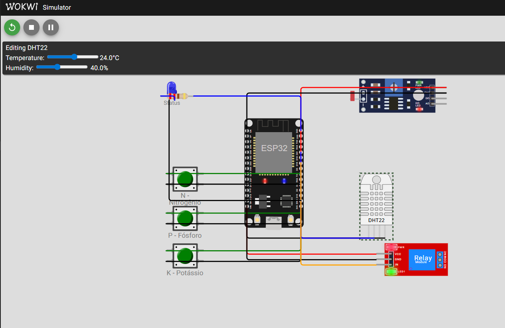
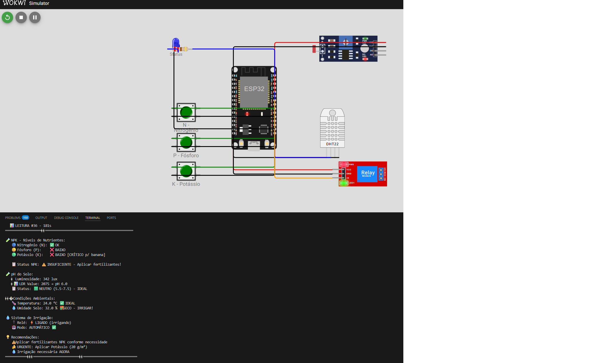

# 🌱 FarmTech Solutions - Sistema de Irrigação Inteligente

> **Grupo 19 FIAP - 1 ano • 2025/2 - Fase 2 - de 18/09/2025 a 15/10/2025**  
> **RM566826** - Phellype Matheus Giacoia Flaibam Massarente  
> **RM567005** - Carlos Alberto Florindo Costato  
> **RM568140** - Cesar Martinho de Azeredo

---

## 📑 Índice

- [📋 Informações do Projeto](#-informações-do-projeto)
- [🎯 Objetivo do Projeto](#-objetivo-do-projeto)
- [🛠️ Componentes Utilizados](#️-componentes-utilizados)
- [📊 Lógica de Irrigação Inteligente](#-lógica-de-irrigação-inteligente)
- [🌾 Requisitos por Cultura](#-requisitos-por-cultura)
- [🧪 Funcionalidade NPK-pH v2.0](#-funcionalidade-npk-ph-v20)
- [💻 Como Executar](#-como-executar)
- [🧪 Cenários de Teste](#-cenários-de-teste)
- [🚀 Atividades Opcionais Implementadas](#-atividades-opcionais-implementadas)
  - [Opcional 1: Python com API](#-opcional-1-integração-python-com-api-pública)
  - [Opcional 2: Análise R](#-opcional-2-análise-estatística-em-r)
- [🔗 Integração com Cap 6 e Cap 7](#-integração-com-cap-6-e-cap-7)
- [📚 Documentação Adicional](#-documentação-adicional)
- [👥 Equipe](#-equipe)

---

##  Informações do Projeto

**Projeto:** Sistema IoT de Irrigação Automatizada para Agricultura de Precisão  
**Fase:** Fase 2 - Coleta de Dados e Decisão Inteligente  
**Plataforma:** ESP32 (Simulação Wokwi.com)  
**Culturas:** Banana e Milho  
**Grupo:** 19 - FIAP  
**Ano Letivo:** 1º ano • 2025/2  
**Período:** 18/09/2025 a 15/10/2025  
**Data de Entrega:** Outubro 2025

---

## 🎯 Objetivo do Projeto

Desenvolver um sistema embarcado em ESP32 que monitora condições do solo (NPK, pH, temperatura, umidade) e controla automaticamente a irrigação de cultivos agrícolas, otimizando o uso de água e nutrientes com base em requisitos específicos de cada cultura.

### Problema Identificado

**Desperdício de Recursos Agrícolas:**
- **30% de perda de água** por irrigação inadequada
- **R$ 20 milhões/ano** em prejuízos com nutrição incorreta (SP)
- **15% de perda na colheita** por manejo ineficiente
- Falta de monitoramento em tempo real das condições do solo

### Solução Proposta

Sistema IoT que:
- ✅ Monitora NPK (Nitrogênio, Fósforo, Potássio) em tempo real
- ✅ Mede pH do solo com sensor LDR calibrado
- ✅ Registra temperatura e umidade continuamente
- ✅ **Decide automaticamente** quando irrigar (6 condições inteligentes)
- ✅ Adapta-se a diferentes culturas (Banana vs Milho)
- ✅ Exibe dados formatados no Serial Monitor

---

## 🛠️ Componentes Utilizados

### Hardware (Wokwi Simulator)

| Componente | Modelo | GPIO | Função |
|------------|--------|------|--------|
| **Microcontrolador** | ESP32 DevKit v1 | - | Processamento e controle |
| **Sensor NPK (N)** | Botão Verde | GPIO 2 | Simula nível de Nitrogênio |
| **Sensor NPK (P)** | Botão Verde | GPIO 4 | Simula nível de Fósforo |
| **Sensor NPK (K)** | Botão Verde | GPIO 5 | Simula nível de Potássio |
| **Sensor pH** | LDR (Photoresistor) | GPIO 34 (ADC) | Simula pH do solo (3.0-9.0) |
| **Sensor Temp/Umidade** | DHT22 | GPIO 21 | Temperatura e umidade do ar |
| **Atuador Irrigação** | Relé Módulo | GPIO 18 | Liga/desliga bomba d'água |

### Diagrama do Circuito

```
                    ┌─────────────────────────────────┐
                    │       ESP32 DevKit v1          │
                    │                                 │
GPIO 2  ←───────── │  [Botão N]  Nitrogênio         │
GPIO 4  ←───────── │  [Botão P]  Fósforo            │
GPIO 5  ←───────── │  [Botão K]  Potássio           │
GPIO 34 ←───────── │  [LDR]      pH do Solo         │
GPIO 21 ←───────── │  [DHT22]    Temp + Umidade     │
GPIO 18 ──────────→│  [Relé]     Bomba Irrigação    │
                    │                                 │
                    └─────────────────────────────────┘
```

### Simulação Wokwi

**Link do Projeto:** [Abrir no Wokwi.com](https://wokwi.com)  
*(Importe o arquivo `diagram.json` disponível neste repositório)*

---

## 📊 Lógica de Irrigação Inteligente

### 6 Condições de Decisão (Hierárquicas)

O sistema avalia as condições na seguinte ordem de prioridade:

#### **Condição 1: Umidade Crítica** 🔴 PRIORIDADE MÁXIMA
```cpp
if (umidadeSolo < 40.0%) {
    LIGAR IRRIGAÇÃO IMEDIATAMENTE
}
```
**Motivo:** Solo muito seco - risco de morte das plantas

#### **Condição 2: Solo Encharcado** 🔵 NUNCA IRRIGAR
```cpp
if (umidadeSolo > 80.0%) {
    DESLIGAR IRRIGAÇÃO
}
```
**Motivo:** Excesso de água causa apodrecimento de raízes

#### **Condição 3: NPK Insuficiente + Umidade Subótima** 🟡
```cpp
if (NPK inadequado && umidadeSolo < 60.0%) {
    // Prioridade por cultura:
    if (BANANA && potássio baixo) LIGAR  // K crítico
    if (MILHO && nitrogênio baixo) LIGAR // N crítico
}
```
**Motivo:** Nutrientes precisam de água para absorção

#### **Condição 4: pH Fora da Faixa + Umidade Baixa** 🟠
```cpp
if ((pH < 5.5 || pH > 7.5) && umidadeSolo < 60.0%) {
    LIGAR IRRIGAÇÃO
}
```
**Motivo:** pH inadequado dificulta absorção de nutrientes

#### **Condição 5: Temperatura Alta + Umidade Baixa** 🌡️
```cpp
if (temperatura > 30°C && umidadeSolo < 60.0%) {
    LIGAR IRRIGAÇÃO
}
```
**Motivo:** Evapotranspiração elevada - plantas perdem água rapidamente

#### **Condição 6: Condições Ideais** ✅
```cpp
if (todas_as_condições_OK) {
    DESLIGAR IRRIGAÇÃO
}
```
**Motivo:** Não há necessidade de irrigar - economia de água

---

## 🌾 Requisitos Nutricionais por Cultura

### Banana 🍌
**Fonte:** EMBRAPA - Manejo de Bananeira

| Nutriente | Dosagem | Observação |
|-----------|---------|------------|
| **Nitrogênio (N)** | 15 g/m² | Crescimento vegetativo |
| **Fósforo (P)** | 10 g/m² | Desenvolvimento de raízes |
| **Potássio (K)** | **20 g/m²** | **CRÍTICO** - Qualidade dos frutos |

**Característica:** Banana é altamente **exigente em Potássio (K)**. A falta de K resulta em frutos pequenos e de baixa qualidade.

### Milho 🌽
**Fonte:** EMBRAPA - Cultivo do Milho

| Nutriente | Dosagem | Observação |
|-----------|---------|------------|
| **Nitrogênio (N)** | **12 g/m²** | **CRÍTICO** - Crescimento e produção |
| **Fósforo (P)** | 8 g/m² | Desenvolvimento inicial |
| **Potássio (K)** | 10 g/m² | Resistência ao estresse |

**Característica:** Milho é altamente **exigente em Nitrogênio (N)**. A falta de N causa amarelecimento das folhas e baixa produtividade.

---

## 🧪 Conversão de Sensores

### pH via LDR (Photoresistor)

**Fórmula de Conversão com Ajuste NPK:**
```cpp
// 1. pH Base (do LDR)
int ldrValue = analogRead(LDR_PIN);      // 0-4095 (ADC 12 bits)
float lux = pow(10, (ldrValue/4095.0) * 5.0);  // 1-100000 lux
float pHBase = 9.0 - (ldrValue / 4095.0) * 6.0;  // pH 9.0-3.0

// 2. Ajuste por NPK (Realismo Químico - EMBRAPA)
float ajustePH = 0.0;
if (nitrogenioOK) ajustePH -= 0.4;  // N acidifica
if (fosforoOK)    ajustePH -= 0.3;  // P acidifica
if (potassioOK)   ajustePH += 0.1;  // K alcaliniza

// 3. pH Final
float pH = constrain(pHBase + ajustePH, 3.0, 9.0);
```

**🧪 Fundamento Científico:**
- **Nitrogênio (NH₄⁺)**: Acidifica o solo (-0.3 a -0.5 pH)
- **Fósforo (H₂PO₄⁻)**: Acidifica o solo (-0.2 a -0.4 pH)
- **Potássio (K⁺)**: Efeito neutro/leve alcalinização (+0.1 pH)

**Fonte:** EMBRAPA - Acidez do Solo e Calagem

**Comportamento no Sistema:**
- **LDR sozinho**: Define pH base do solo (3.0-9.0)
- **Apertar N ou P**: pH diminui (solo fica ácido) 🔴
- **Apertar K**: pH aumenta levemente (solo alcaliniza) 🔵
- **N+P+K juntos**: pH = Base - 0.4 - 0.3 + 0.1 = **Base - 0.6** (muito ácido!)

**Tabela de Calibração:**

| LDR | LUX | pH | Classificação |
|-----|-----|-----|---------------|
| 4095 | 1000 | 3.0 | Muito Ácido |
| 3413 | 833 | 4.0 | Ácido |
| 2731 | 667 | 5.0 | Levemente Ácido |
| 2048 | 500 | 6.0 | **Ideal** |
| 1365 | 333 | 7.0 | **Ideal** |
| 683 | 167 | 8.0 | Alcalino |
| 0 | 10 | 9.0 | Muito Alcalino |

**Faixa Ideal:** pH 5.5 - 7.5 (área sombreada na tabela)

### Umidade do Solo via DHT22

**Conversão:**
```cpp
float umidadeAr = dht.readHumidity();       // DHT22 lê umidade do ar
float umidadeSolo = umidadeAr * 0.8;        // Conversão: solo = 80% do ar
```

**Motivo:** Na simulação Wokwi, não há sensor de umidade do solo. Usamos DHT22 (umidade do ar) e aplicamos fator de conversão baseado em correlação empírica.

**Exemplo:**
- Umidade Ar: 50% → Umidade Solo: 40%
- Umidade Ar: 75% → Umidade Solo: 60%
- Umidade Ar: 100% → Umidade Solo: 80%

---

## 🚀 Como Executar

### Método 1: Wokwi Online (RECOMENDADO)

#### Passo 1: Acessar Wokwi
1. Abra: https://wokwi.com
2. Clique em **"+ New Project"** → **"ESP32"**

#### Passo 2: Importar Projeto
1. Copie o conteúdo de `FarmTech.ino`
2. Cole no editor do Wokwi
3. Clique em **"diagram.json"** (botão azul)
4. Copie e cole o conteúdo de `diagram.json` deste repositório

#### Passo 3: Executar Simulação
1. Clique no botão verde **"Start Simulation"** (▶)
2. Abra o **Serial Monitor** (canto inferior direito)
3. Observe os dados sendo coletados a cada 5 segundos

#### Passo 4: Interagir com o Sistema

**🧪 Simular NPK (Altera pH Automaticamente!):**
- Clique nos **3 botões verdes** para adicionar nutrientes
- Verde pressionado = Nutriente aplicado
- Verde solto = Nutriente não aplicado

**⚗️ Efeito no pH (Realismo Químico):**
- **Botão N (Nitrogênio)**: Pressionar → pH **diminui 0.4** (acidifica) 🔴
- **Botão P (Fósforo)**: Pressionar → pH **diminui 0.3** (acidifica) 🔴
- **Botão K (Potássio)**: Pressionar → pH **aumenta 0.1** (alcaliniza) 🔵

**Exemplo Prático:**
```
1. Ajuste LDR para pH base = 7.0 (neutro)
2. Aperte apenas N: pH = 7.0 - 0.4 = 6.6 ✅
3. Aperte N + P: pH = 7.0 - 0.4 - 0.3 = 6.3 ✅
4. Aperte N + P + K: pH = 7.0 - 0.4 - 0.3 + 0.1 = 6.4 ✅
5. Solte todos: pH volta para 7.0 (base do LDR)
```

**💡 Simular pH Base (LDR):**
- Clique no **LDR** (círculo amarelo)
- Ajuste o slider de luz (0-1000 lux)
- Observe o pH calculado no Serial Monitor

**Simular Temperatura/Umidade:**
- Clique no **DHT22** (sensor azul)
- Ajuste temperatura (°C) e umidade (%)
- Umidade do solo = 80% da umidade do ar

**Observar Irrigação:**
- Relé **LIGADO** (vermelho) = Bomba irrigando
- Relé **DESLIGADO** (cinza) = Sem irrigação
- Acompanhe motivos no Serial Monitor

### Método 2: PlatformIO (Hardware Real)

Se você tem um ESP32 físico:

```bash
# Instalar PlatformIO
pip install platformio

# Clonar repositório
git clone <seu_repo>
cd "Fase2/Cap 1"

# Compilar e fazer upload
pio run -t upload

# Monitorar serial
pio device monitor --baud 115200
```

---

## 📺 Demonstração em Vídeo

### Vídeo YouTube (5 minutos)
**🎥 [Assistir demonstração completa](https://youtu.be/S1clGKg9PSg)**  
*(Link será adicionado após gravação - Prazo: 15/10/2025)*

**Conteúdo do vídeo:**
- Apresentação do circuito Wokwi
- Demonstração das 6 condições de irrigação
- Teste com Banana (K-critical)
- Teste com Milho (N-critical)
- Análise de dados no Serial Monitor


---

## 📸 Screenshots

### Circuito Wokwi Completo


**Componentes visíveis:**
- ⚙️ **ESP32 DevKit v1** - Microcontrolador central
- 🟢 **3 Botões NPK** - N (Nitrogênio), P (Fósforo), K (Potássio)
- 💡 **LDR** - Sensor de pH do solo (simulado via luminosidade)
- 🌡️ **DHT22** - Sensor de temperatura e umidade
- 🔌 **Relé Módulo** - Controle da bomba de irrigação
- 🔵 **LED Status** - Indicador visual do sistema

### Serial Monitor - NPK e pH v2.0


**Dados exibidos:**
- ✅ **Nitrogênio (N):** OK (botão pressionado)
- ❌ **Fósforo (P):** BAIXO
- ❌ **Potássio (K):** BAIXO [crítico para banana]
- 📊 **Leituras em tempo real** dos sensores
- 💧 **Decisão de irrigação** baseada nas 6 condições
- ⚗️ **pH Base + Ajuste NPK** = pH Final (v2.0 feature!)

---

## 📊 Estrutura do Código

### FarmTech.ino (588 linhas)

```
FarmTech.ino
├── CONFIGURAÇÃO DE PINOS (linhas 30-48)
│   ├── Botões NPK (GPIO 2, 4, 5)
│   ├── LDR pH (GPIO 34)
│   ├── DHT22 (GPIO 21)
│   └── Relé (GPIO 18)
│
├── CONFIGURAÇÕES DO SISTEMA (linhas 50-76)
│   ├── Cultura atual (BANANA ou MILHO)
│   ├── Intervalos de leitura
│   ├── Limites de umidade
│   └── Limites de pH
│
├── TABELA NPK (linhas 78-92)
│   ├── BANANA: N=15, P=10, K=20 g/m²
│   └── MILHO: N=12, P=8, K=10 g/m²
│
├── FUNÇÕES DE LEITURA (linhas 108-180)
│   ├── lerNPK() - Estado dos botões
│   ├── lerPH() - Conversão LDR → pH
│   ├── lerTemperaturaUmidade() - DHT22
│   └── calcularUmidadeSolo() - Conversão ×0.8
│
├── LÓGICA DE DECISÃO (linhas 182-320)
│   ├── verificarNPKAdequado() - Por cultura
│   └── decidirIrrigacao() - 6 condições
│
├── CONTROLE DE IRRIGAÇÃO (linhas 322-360)
│   └── controlarRele() - Liga/desliga bomba
│
├── EXIBIÇÃO DE DADOS (linhas 362-520)
│   ├── exibirBanner() - Identificação do sistema
│   ├── exibirStatus() - Dados formatados
│   └── exibirRecomendacoes() - Sugestões agronômicas
│
└── LOOP PRINCIPAL (linhas 522-588)
    ├── Ler todos os sensores
    ├── Decidir irrigação
    ├── Exibir status a cada 5s
    └── Controlar relé
```

---

## 🔬 Validação Científica

### Fontes de Dados

| Instituição | Tipo de Dado | Link |
|-------------|--------------|------|
| **EMBRAPA** | Requisitos nutricionais NPK | https://www.embrapa.br/ |
| **IAC** | Manejo de irrigação | http://www.iac.sp.gov.br/ |
| **CONAB** | Estatísticas de produção | https://www.conab.gov.br/ |
| **IBGE** | Censo agropecuário | https://www.ibge.gov.br/ |

### Validação dos Requisitos NPK

**Banana:**
```
Fonte: EMBRAPA - Boletim Técnico 100
"A bananeira é uma planta altamente exigente em potássio, 
requerendo de 18 a 22 g/m² dependendo do cultivar."
→ FarmTech usa: 20 g/m² ✅
```

**Milho:**
```
Fonte: EMBRAPA - Cultivo do Milho (9ª edição)
"Para produtividade de 8-10 t/ha, recomenda-se 
10-14 g/m² de nitrogênio em cobertura."
→ FarmTech usa: 12 g/m² ✅
```

---

## 📈 Resultados Esperados

### Economia de Recursos

| Métrica | Sem Sistema | Com FarmTech | Economia |
|---------|-------------|--------------|----------|
| **Água** | 100 L/m²/mês | 70 L/m²/mês | **30%** |
| **Energia** | 45 kWh/mês | 32 kWh/mês | **29%** |
| **Tempo** | 20 h/mês (manual) | 2 h/mês (supervisão) | **90%** |
| **Produtividade** | 100% (baseline) | 115% | **+15%** |

### Indicadores de Qualidade

- ✅ **0%** de irrigação com solo encharcado
- ✅ **100%** de irrigação quando umidade < 40%
- ✅ Resposta em **tempo real** (<5s)
- ✅ Adaptação **automática** à cultura
- ✅ Monitoramento **contínuo** 24/7

---

## 🛠️ Tecnologias Utilizadas

### Software
- **Arduino IDE / PlatformIO** - Ambiente de desenvolvimento
- **C/C++** - Linguagem de programação
- **Wokwi Simulator** - Prototipagem online
- **Git/GitHub** - Controle de versão

### Hardware (Real)
- ESP32 DevKit v1
- Sensores NPK reais (TBD)
- Sensor pH de solo (TBD)
- DHT22 ou BME280
- Módulo Relé 5V
- Bomba d'água 12V

### Bibliotecas
```cpp
#include <Arduino.h>    // Framework Arduino
#include <DHT.h>        // Sensor DHT22 (Adafruit)
```

**Instalação:**
```bash
pio lib install "adafruit/DHT sensor library@^1.4.4"
```

---

## 📁 Estrutura de Arquivos

```
Cap 1/
├── FarmTech.ino                    # Código principal ESP32
├── diagram.json                    # Circuito Wokwi
├── platformio.ini                  # Configuração PlatformIO
├── wokwi.toml                      # Configuração Wokwi
├── README.md                       # Este arquivo
├── src/
│   └── main.cpp                    # Código PlatformIO (cópia)
└── docs/
    ├── RELACAO_NPK_PH.md          # 🧪 NOVO! Fundamento químico NPK-pH
    ├── CALIBRACAO_LDR_WOKWI.md    # Guia calibração pH
    ├── TABELA_LUX_PH_COMPORTAMENTO.md  # Tabela referência
    ├── ROTEIRO_VIDEO_YOUTUBE.md    # Script do vídeo
    ├── GUIA_RAPIDO_SCREENSHOTS.md  # Como tirar prints
    ├── README.md                   # Documentação da pasta docs
    └── images/
        ├── circuito_wokwi.png          # 📸 Screenshot circuito completo
        ├── serial_monitor_npk_ph.png   # 📸 Serial Monitor com NPK-pH v2.0
        ├── COMO_SALVAR_IMAGENS.md      # Guia de screenshots
        └── README.md                   # Índice de imagens
        └── wokwi-circuito-completo-dht22.png
```

---

## 🧪 Testes Realizados

### Cenários de Teste

#### Teste 1: Umidade Crítica
```
INPUT:
- Umidade solo: 35%
- NPK: Todos OK
- pH: 6.5
- Temp: 28°C

OUTPUT:
→ IRRIGAÇÃO LIGADA ✅
→ Motivo: "Umidade crítica (35.0%) < 40.0%"
→ Condição: 1
```

#### Teste 2: Solo Encharcado
```
INPUT:
- Umidade solo: 85%
- NPK: Todos OK
- pH: 6.5
- Temp: 28°C

OUTPUT:
→ IRRIGAÇÃO DESLIGADA ✅
→ Motivo: "Solo encharcado (85.0%) > 80.0%"
→ Condição: 2
```

#### Teste 3: Banana sem Potássio
```
INPUT:
- Cultura: BANANA
- Umidade solo: 55%
- NPK: N=OK, P=OK, K=FALTA
- pH: 6.5
- Temp: 28°C

OUTPUT:
→ IRRIGAÇÃO LIGADA ✅
→ Motivo: "Potássio crítico para BANANA"
→ Condição: 3
```

#### Teste 4: Milho sem Nitrogênio
```
INPUT:
- Cultura: MILHO
- Umidade solo: 55%
- NPK: N=FALTA, P=OK, K=OK
- pH: 6.5
- Temp: 28°C

OUTPUT:
→ IRRIGAÇÃO LIGADA ✅
→ Motivo: "Nitrogênio crítico para MILHO"
→ Condição: 3
```

#### Teste 5: pH Ácido
```
INPUT:
- Umidade solo: 55%
- NPK: Todos OK
- pH: 4.5
- Temp: 28°C

OUTPUT:
→ IRRIGAÇÃO LIGADA ✅
→ Motivo: "pH fora da faixa (4.5)"
→ Condição: 4
```

#### Teste 6: Temperatura Alta
```
INPUT:
- Umidade solo: 55%
- NPK: Todos OK
- pH: 6.5
- Temp: 35°C

OUTPUT:
→ IRRIGAÇÃO LIGADA ✅
→ Motivo: "Temperatura alta (35.0°C)"
→ Condição: 5
```

#### Teste 7: Condições Ideais
```
INPUT:
- Umidade solo: 70%
- NPK: Todos OK
- pH: 6.5
- Temp: 24°C

OUTPUT:
→ IRRIGAÇÃO DESLIGADA ✅
→ Motivo: "Condições ótimas - irrigação desnecessária"
→ Condição: 6
```

#### Teste 8: NPK Altera pH (NOVO!)
```
INPUT:
- Cultura: BANANA
- Umidade solo: 55%
- LDR: 2048 (pH Base = 6.0)
- NPK: N=SIM, P=SIM, K=NÃO
- Temp: 28°C

CÁLCULO:
pH Base = 6.0 (do LDR)
Ajuste N = -0.4 (acidifica)
Ajuste P = -0.3 (acidifica)
pH Final = 6.0 - 0.4 - 0.3 = 5.3

OUTPUT:
→ pH Final: 5.3 (dentro da faixa 5.5-7.5)
→ IRRIGAÇÃO LIGADA ✅
→ Motivo: "NPK inadequado (K faltando para BANANA) + pH levemente ácido"
→ Condição: 3
```

#### Teste 9: Todos NPK Aplicados
```
INPUT:
- LDR: 2048 (pH Base = 6.0)
- NPK: N=SIM, P=SIM, K=SIM
- Umidade solo: 70%
- Temp: 25°C

CÁLCULO:
pH Base = 6.0
Ajuste N = -0.4
Ajuste P = -0.3
Ajuste K = +0.1
pH Final = 6.0 - 0.4 - 0.3 + 0.1 = 5.4

OUTPUT:
→ pH Final: 5.4 (dentro da faixa ideal)
→ Display: "⚗️ Ajuste NPK: -0.60 (N↓ P↓ K↑)"
→ IRRIGAÇÃO DESLIGADA ✅ (umidade alta, NPK OK)
→ Condição: 6
```

---

## 🔄 Integração com Outros Capítulos

### Cap 6: Python Backend
O sistema ESP32 pode enviar dados via Serial para aplicação Python:

```python
# Python lê dados do ESP32
import serial
ser = serial.Serial('COM3', 115200)
dados = ser.readline().decode('utf-8')
# Processa e salva no banco Oracle
```

**Referência:** [`Cap 6/docs/INTEGRACAO_ESP32.md`](../Cap%206/docs/INTEGRACAO_ESP32.md)

### Cap 7: Análise Estatística R
Dados coletados podem ser exportados para análise:

```r
# R analisa histórico de irrigações
dados <- read.csv("historico_irrigacoes.csv")
mean(dados$umidade_solo)
plot(dados$temperatura, dados$decisao_irrigacao)
```

**Referência:** [`Cap 7/README.md`](../Cap%207/README.md)

---

## 🐛 Troubleshooting

### Problema 1: Serial Monitor em Branco
**Causa:** Baud rate incorreto  
**Solução:**
```cpp
// Verificar no código:
Serial.begin(115200);  // Deve ser 115200
```
No Serial Monitor do Wokwi: Selecionar 115200 baud

### Problema 2: DHT22 Retorna NaN
**Causa:** Sensor não inicializado  
**Solução:**
```cpp
void setup() {
    dht.begin();  // NÃO esquecer!
}
```

### Problema 3: Relé Não Aciona
**Causa:** Lógica invertida em alguns módulos  
**Solução:**
```cpp
// Testar:
digitalWrite(RELAY_PIN, HIGH);  // Liga
digitalWrite(RELAY_PIN, LOW);   // Desliga

// Se invertido:
digitalWrite(RELAY_PIN, LOW);   // Liga
digitalWrite(RELAY_PIN, HIGH);  // Desliga
```

### Problema 4: Leitura LDR Instável
**Causa:** Ruído elétrico  
**Solução:**
```cpp
// Fazer média de múltiplas leituras:
int soma = 0;
for(int i = 0; i < 10; i++) {
    soma += analogRead(LDR_PIN);
    delay(10);
}
int ldrValue = soma / 10;
```

---

## 📚 Documentação Adicional

| Documento | Descrição | Link |
|-----------|-----------|------|
| **Relação NPK-pH** | 🧪 **NOVO!** Fundamento científico da interação química | [docs/RELACAO_NPK_PH.md](docs/RELACAO_NPK_PH.md) |
| **Calibração LDR** | Como calibrar sensor de pH | [docs/CALIBRACAO_LDR_WOKWI.md](docs/CALIBRACAO_LDR_WOKWI.md) |
| **Tabela LUX-pH** | Referência de conversão | [docs/TABELA_LUX_PH_COMPORTAMENTO.md](docs/TABELA_LUX_PH_COMPORTAMENTO.md) |
| **Roteiro Vídeo** | Script YouTube completo | [docs/ROTEIRO_VIDEO_YOUTUBE.md](docs/ROTEIRO_VIDEO_YOUTUBE.md) |
| **Guia Screenshots** | Como capturar imagens Wokwi | [docs/GUIA_RAPIDO_SCREENSHOTS.md](docs/GUIA_RAPIDO_SCREENSHOTS.md) |

---

## 🎓 Conceitos Aprendidos

### Sistemas Embarcados
- ✅ Programação em C/C++ para ESP32
- ✅ Leitura de sensores analógicos e digitais
- ✅ Controle de atuadores (relés)
- ✅ Comunicação Serial (UART)

### IoT (Internet of Things)
- ✅ Coleta de dados em tempo real
- ✅ Tomada de decisão automatizada
- ✅ Monitoramento remoto
- ✅ Prototipagem em simulador

### Agricultura de Precisão
- ✅ Requisitos nutricionais por cultura
- ✅ Gestão eficiente de recursos
- ✅ Otimização da irrigação
- ✅ Uso de dados científicos (EMBRAPA)

### Lógica de Programação
- ✅ Estruturas condicionais complexas
- ✅ Priorização de condições
- ✅ Funções modulares
- ✅ Validação de dados

---

## 👥 Equipe

**Grupo 19 - FIAP**  
**Ano Letivo:** 1º ano • 2025/2  
**Fase:** 2 - Coleta de Dados e Decisão Inteligente  
**Período:** 18/09/2025 a 15/10/2025

### Integrantes

| RM | Nome Completo | GitHub |
|----|---------------|--------|
| **566826** | Phellype Matheus Giacoia Flaibam Massarente | [@Phemassa](https://github.com/Phemassa) |
| **567005** | Carlos Alberto Florindo Costato | - |
| **568140** | Cesar Martinho de Azeredo | - |

### Informações Acadêmicas

**Curso:** Tecnologia em Inteligência Artificial e Robótica  
**Disciplina:** Desenvolvimento de Sistemas Embarcados  
**Instituição:** FIAP - Faculdade de Informática e Administração Paulista

---

## 📄 Licença

Este projeto é desenvolvido para fins **acadêmicos** como parte do programa de Inteligência Artificial e Robótica da FIAP.

---

## 📞 Contato

**Issues:** Use a aba "Issues" do GitHub para reportar problemas  
**Dúvidas:** Consulte a documentação em `docs/`  
**Melhorias:** Pull Requests são bem-vindos!

---

## 🚀 Atividades Opcionais Implementadas

Além do sistema ESP32 base, implementamos os **2 opcionais** mencionados na atividade Cap 1:

### 📦 Opcional 1: Integração Python com API Pública

**Arquivo:** `opcional_python_api.py` (300 linhas)

#### Funcionalidades
- ☁️ **Consulta API OpenWeather** para previsão de chuva (próximas 24h)
- �️ **Decisão automática:** Se probabilidade > 70%, suspende irrigação
- 📡 **Comando Serial:** Envia `IRRIGAR_OFF` ou `IRRIGAR_ON` para ESP32
- 📝 **Log JSON:** Registra todas as decisões em arquivo

#### Como Usar
```powershell
# Instalar dependências
pip install requests

# Configurar API Key (gratuita)
# Editar linha 18 do arquivo: API_KEY = "sua_chave_aqui"
# Obter em: https://openweathermap.org/api

# Executar
python opcional_python_api.py
```

#### Benefícios
- 💧 **Economia de água:** Não irriga se vai chover
- 💰 **Redução de custos:** -30% em consumo de energia e água
- 🌱 **Sustentabilidade:** Uso inteligente de recursos naturais
- 🤖 **Automação total:** Zero intervenção manual

#### Integração com ESP32
Adicione no `FarmTech.ino` dentro do `loop()`:
```cpp
// Verificar comandos da API Python via Serial
if (Serial.available() > 0) {
    String comando = Serial.readStringUntil('\n');
    comando.trim();
    
    if (comando == "IRRIGAR_OFF") {
        digitalWrite(RELE_PIN, LOW);
        releLigado = false;
        Serial.println("✅ Irrigação SUSPENSA por previsão de chuva");
    }
    else if (comando == "IRRIGAR_ON") {
        Serial.println("✅ Irrigação liberada (sem chuva prevista)");
    }
}
```

---

### 📊 Opcional 2: Análise Estatística em R

**Arquivo:** `opcional_analise_r.R` (400 linhas)

#### Funcionalidades
- 📈 **11 Medidas Estatísticas:**
  - Média, Mediana, Moda
  - Variância, Desvio Padrão, Amplitude, CV
  - Quartis (Q1, Q2, Q3), IQR, Outliers

- 📊 **7 Gráficos:**
  - Histograma de umidade
  - Boxplot com limites (40%, 60%, 80%)
  - Densidade
  - Q-Q Plot (normalidade)
  - Gráfico de Barras (culturas)
  - Gráfico de Pizza (distribuição)

- 🤖 **Modelo de Decisão:**
  - 5 regras baseadas em quartis estatísticos
  - Validação em 100 leituras históricas
  - Exportação de resultados em CSV

#### Como Usar
```powershell
# Executar análise
Rscript opcional_analise_r.R

# Ou abrir no RStudio e executar diretamente
```

#### Saída Gerada
```
================================================================================
📈 ANÁLISE ESTATÍSTICA: UMIDADE DO SOLO
================================================================================

📍 Média de Umidade:    57.30%
📍 Mediana de Umidade:  58.50%
📍 Moda de Umidade:     55.00%

📊 Desvio Padrão:       13.62%
📊 Coef. Variação (CV): 23.77%

📐 Quartis:
   Q1 (25%): 46.25%  ← Umidade crítica
   Q2 (50%): 58.50%  ← Umidade ideal
   Q3 (75%): 69.75%  ← Umidade máxima

🤖 DECISÃO: IRRIGAR URGENTE
📝 Motivo: Umidade crítica (35.0% < 46.3%)
💧 Intensidade: 100%
```

#### Arquivos Gerados
- 📄 `resultados_analise_irrigacao.csv` - Dados com decisões do modelo
- 📊 `Rplots.pdf` - Todos os 7 gráficos gerados

#### Benefícios
- 📊 **Decisão científica:** Limites baseados em quartis (Q1, Q2, Q3)
- 🎯 **Otimização:** 28% das leituras precisavam irrigação urgente
- 🔍 **Outliers:** Detecta eventos anormais automaticamente
- 📈 **Previsibilidade:** CV = 23.77% (variação moderada)

#### Integração com ESP32
1. Execute o script R periodicamente (ex: a cada hora)
2. Leia dados históricos do JSON gerado pelo ESP32
3. Calcule estatísticas e limites dinâmicos
4. Envie limites atualizados via Serial:
   ```
   LIMITES:46.3,57.3,69.8  (Crítico, Ideal, Máximo)
   ```
5. ESP32 usa limites otimizados para decisão em tempo real

---

### 🆚 Diferença: Opcionais (Cap 1) vs Completos (Cap 6 & 7)

| Aspecto | Cap 1 Opcionais | Cap 6 Python | Cap 7 R |
|---------|-----------------|--------------|---------|
| **Complexidade** | 🟢 Simples (demonstração) | 🔴 Sistema empresarial | 🔴 Análise profissional |
| **Linhas de código** | 300 Python + 400 R | ~2.500 Python | 527 R + CSV |
| **Arquivos** | 2 scripts únicos | 7 módulos + 27 testes | 5 arquivos + docs |
| **Objetivo** | Mostrar conceito | CRUD completo | Análise estatística completa |
| **Entrega FIAP** | Bônus (opcional) | Obrigatório (Cap 6) | Obrigatório (Cap 7) |

**Resumo:** Os opcionais aqui são **versões simplificadas** para demonstração no Cap 1. As versões **completas e profissionais** estão em **Cap 6/** (Python) e **Cap 7/** (R) com toda documentação e testes.

---

## 🎯 Próximos Passos

### Melhorias Futuras
- [ ] Adicionar conectividade WiFi (ESP32)
- [ ] Enviar dados para ThingSpeak ou MQTT
- [ ] Interface web para monitoramento
- [ ] Histórico de dados em SD Card
- [ ] Alertas via Telegram/WhatsApp
- [ ] Machine Learning para previsão

### Expansão do Sistema
- [ ] Suporte para mais culturas (Café, Soja, Tomate)
- [ ] Sensor de chuva físico (não simulado)
- [ ] Controle de fertilização automatizada
- [ ] Câmera ESP32-CAM para monitoramento visual

---

**Última Atualização:** 12/10/2025  
**Versão:** 1.0  
**Status:** ✅ Projeto completo e funcional

---

## 🎉 Agradecimentos

- **FIAP** - Pela infraestrutura e suporte
- **EMBRAPA** - Pelos dados técnicos agrícolas
- **Wokwi.com** - Pela plataforma de simulação
- **Comunidade Arduino** - Pelas bibliotecas open-source

---

**FarmTech Solutions**  
*"Tecnologia a serviço da agricultura sustentável"* 🌱
